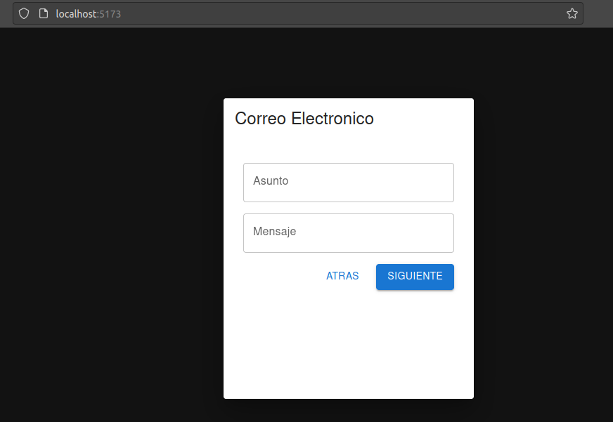
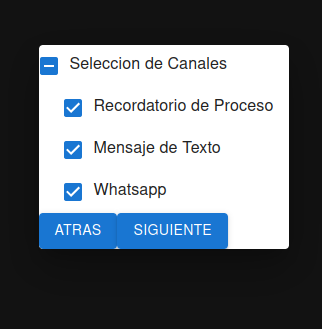

## Getting Started

First:
```bash
git clone https://github.com/kpzaolod6000/-sender-message-reactjs-v1.0.0.git

```
After, run the development server:

```bash
cd -sender-message-reactjs-v1.0.0
npm install
npm run dev
```

Open [http://localhost:3000](http://localhost:3000) with your browser to see the result.

## Project status

This project is completed. 

# Imagen de Ejemplo del Proyecto


