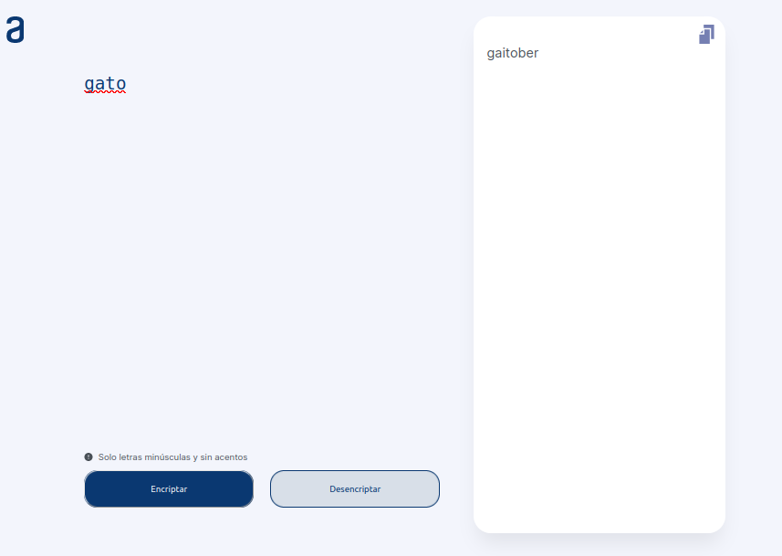
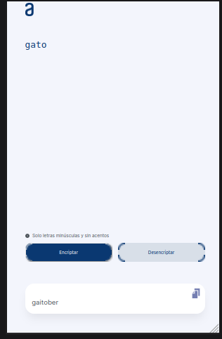
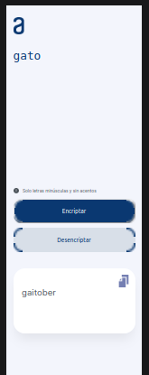

## Getting Started

First:
```bash
git clone https://github.com/kpzaolod6000/...

```
After, run the development server:

```bash
cd  nombre-de-la-archivo
```

Open [http://localhost:3000](http://localhost:3000) with your browser to see the result.

## Project status

This project is not yet complete. 


## Imagen del Proyecto




