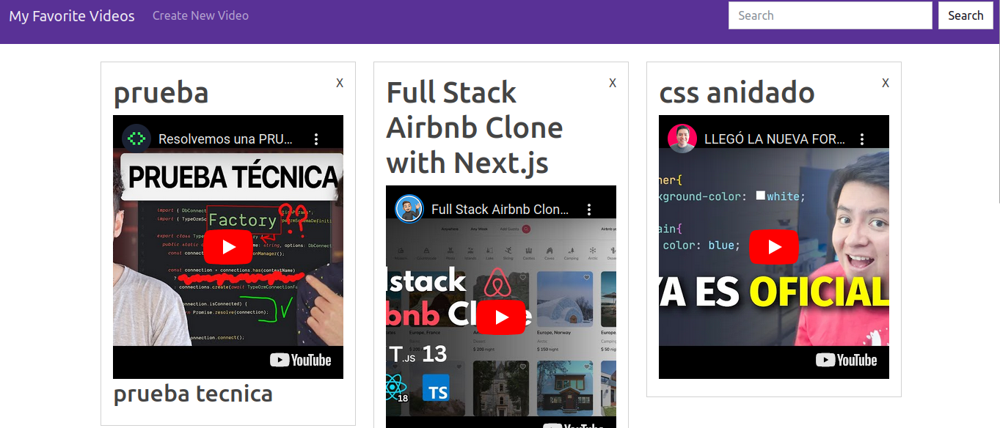

# Getting Started

First:
```bash
git clone https://github.com/kpzaolod6000/...

```
After, run the development server install the api and frontend and enable mongod:

```bash
cd api and cd frontend
npm install
npm run dev
```

Open [http://localhost:3000](http://localhost:3000) with your browser to see the result.

## Project status

This project is completed. 

# Imagen de Ejemplo del Proyecto usando parallax


