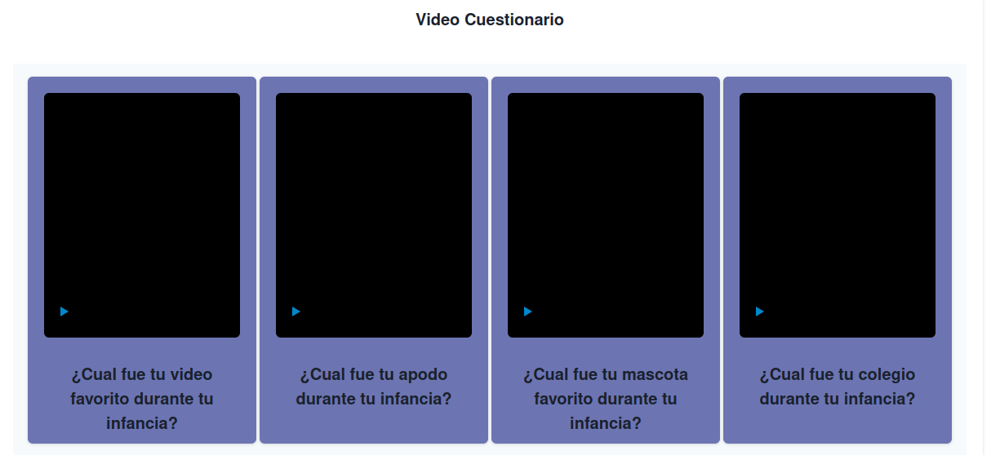
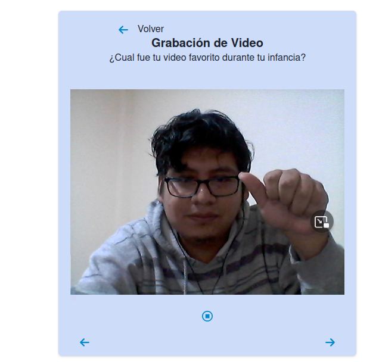
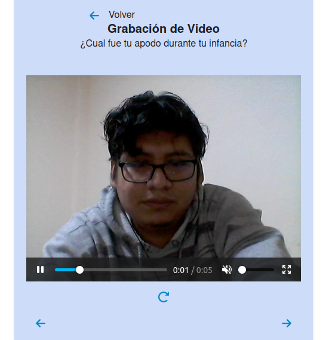
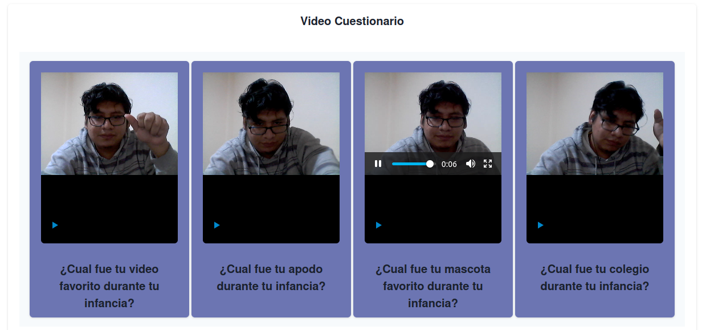

## Getting Started

First:
```bash
git clone https://github.com/kpzaolod6000/-recorted-video-reactjs-v0.0.5.git

```
After, run the development server:

```bash
cd  -recorted-video-reactjs-v0.0.5
npm install
npm run dev
```

Open [http://localhost:3000](http://localhost:3000) with your browser to see the result.

## Project status

This project is not yet complete. 


## Imagen del Proyecto




